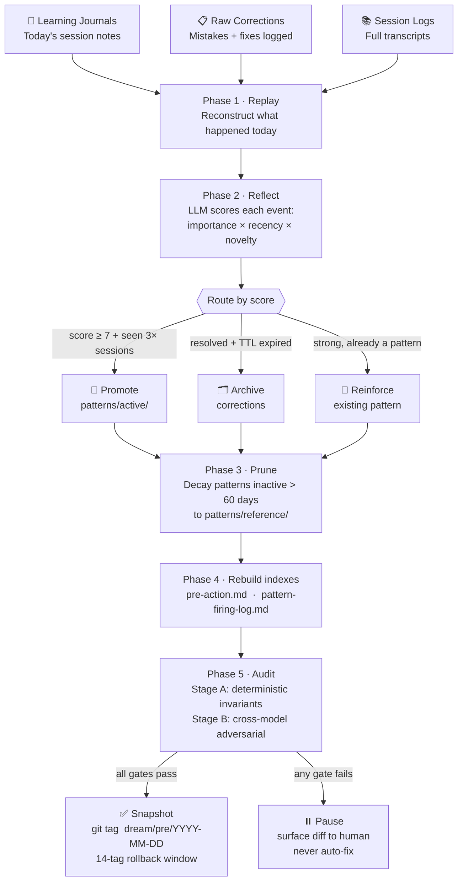
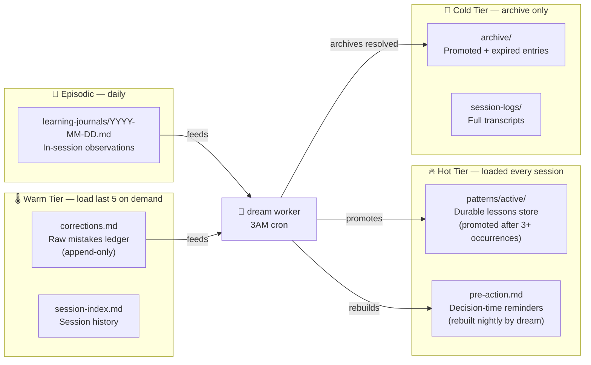

# dream-management

> Nightly memory consolidation for AI agents — the equivalent of REM sleep.

[](./tests)
[](https://www.typescriptlang.org/)
[](https://nodejs.org/)
[](./LICENSE)

AI memory systems fail the same way: **write-heavy, read-light**. Every session adds corrections and patterns. Nothing expires. Memory loaders read a fraction of what was written. Rules exist as text but never fire at decision time.

`dream` is the fix. Run it nightly at 3AM — it replays the day's events, reflects on what mattered, reinforces strong signals, archives noise, and rebuilds lean indexes that actually load at session start.

> Build once, configure per-consumer. Vault, code repo, any agent — same tool, different `dream.config.json`.

---

## How it works



---

## Memory architecture

Three tiers loaded at session start — each progressively larger and loaded more selectively:



---

## The nightly audit (what makes this safe to automate)

Most memory consolidation tools skip safety. `dream` runs two independent gates before committing anything:

| Gate | What it checks | Who runs it |
|---|---|---|
| Stage A — deterministic | No data loss · no orphaned files · no TTL violations · atomicity proof | `lib/auditor-invariants.js` |
| Stage B — adversarial | Pattern promotion logic · source-trust boundary · promotion-gate bypass attempts | Cross-model (Codex audits Claude worker) |

If either gate fails: **pause + surface diff to human. Never auto-rollback. Never auto-fix.**

---

## Quick start

```bash
git clone https://github.com/joydai2026-del/dream-management.git
cd dream-management
npm install

# Point dream at your agent's memory directory
cp dream.config.example.json dream.config.json
# Edit dream.config.json — set memory_root to your agent's memory path

# Dry run first — preview without writing anything
node bin/dream.js --dry-run

# When you're happy, run for real
node bin/dream.js
```

**Schedule nightly (macOS):**
```bash
node schedulers/install-launchd.js
```

**Schedule nightly (Linux/WSL):**
```bash
node schedulers/install-cron.js
```

---

## Key config options

```json
{
  "memory_root": "~/.your-agent/memory",
  "schedule": { "cron": "0 3 * * *" },
  "promotion_gates": {
    "min_importance_score": 7,
    "min_journal_mentions": 3
  },
  "models": {
    "worker_reflection": "claude-sonnet-4-6",
    "auditor_stage_b": "gpt-5-codex"
  }
}
```

Full schema: [docs/config-reference.md](./docs/config-reference.md)

---

## Implementation status

| Phase | Status | Tests |
|---|---|---|
| P0 — contracts (archive schema, atomicity, firing-log) | ✅ shipped | — |
| P1 — hot-path cleanup (atomic writes, corrections TTL, session-index tier) | ✅ shipped | 47 |
| P2 — read-path + pattern-firing-log infra | ✅ shipped (3-round phase-gated review clean) | 64 |
| P3 — one-time pattern cleanup | ✅ shipped | 111 total |
| P4 — dream worker (the actual nightly runner) | 🔜 in progress | — |
| P5 — auditor + scheduling + observability | 🗓️ planned | — |

---

## Research foundations

Built on published AI memory research — with the safety primitives the papers omit:

- [MemGPT (Packer et al.)](https://arxiv.org/abs/2310.08560) — three-tier memory hierarchy
- [Generative Agents (Park et al.)](https://arxiv.org/abs/2304.03442) — reflection + importance scoring
- [Voyager (Wang et al.)](https://arxiv.org/abs/2305.16291) — skill library as procedural memory
- [Sleep-time Compute (Lin et al., Berkeley + Letta)](https://arxiv.org/abs/2504.13171) — cost amortization via offline reasoning
- [CoALA (Sumers et al.)](https://arxiv.org/abs/2512.13564) — episodic → semantic → procedural

Engineering additions not in the papers: cross-model auditor (different blind spots), atomic writes, pattern-firing instrumentation, source-citation requirement on promotion, archive-never-delete with 14-tag rollback.

---

## Docs

- [ARCHITECTURE.md](./ARCHITECTURE.md) — full system design
- [ADR/](./ADR/) — locked architectural decisions (7 ADRs)
- [SUCCESS-CRITERIA.md](./SUCCESS-CRITERIA.md) — testable acceptance criteria per phase
- [docs/archive-schema.md](./docs/archive-schema.md) — archive layout + conservation invariants
- [docs/atomicity-contract.md](./docs/atomicity-contract.md) — `*.tmp` + atomic-rename + lock semantics
- [ADR/007-source-trust-boundary.md](./ADR/007-source-trust-boundary.md) — cross-agent write quarantine

---

Built by [Joy Dong](https://www.joydong.org)
